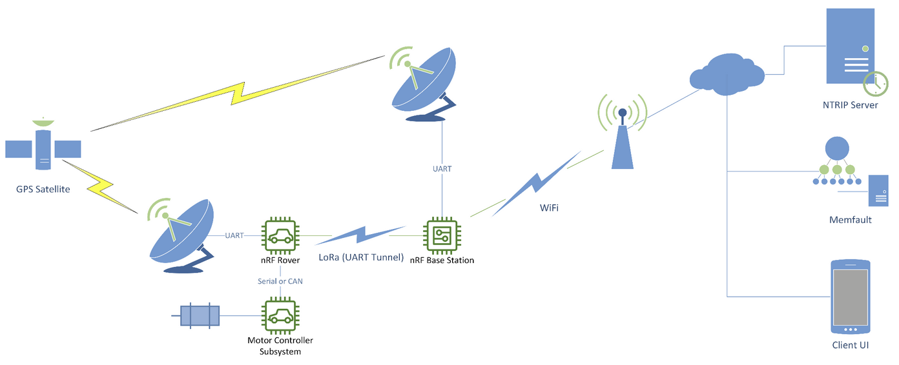
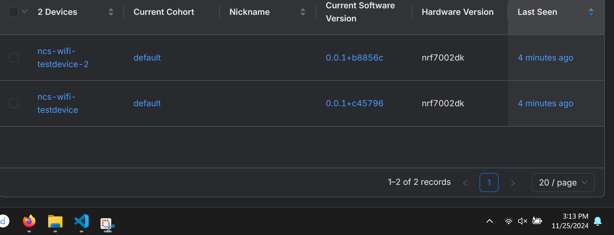
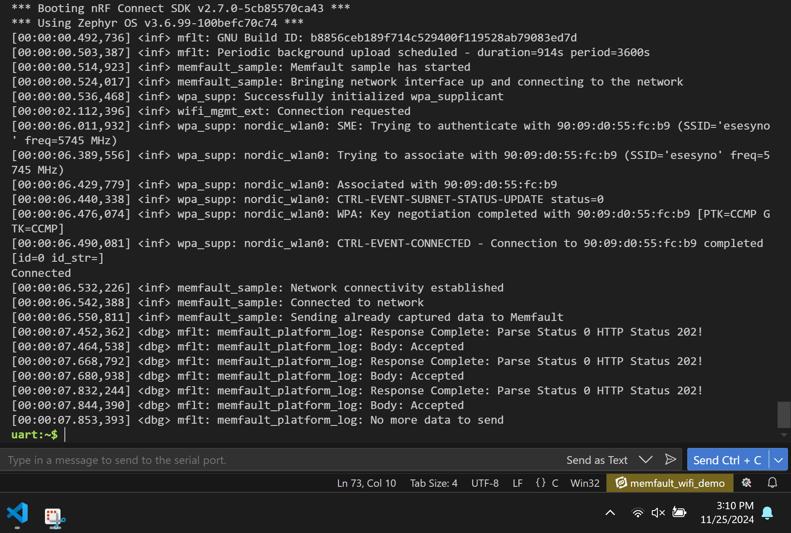
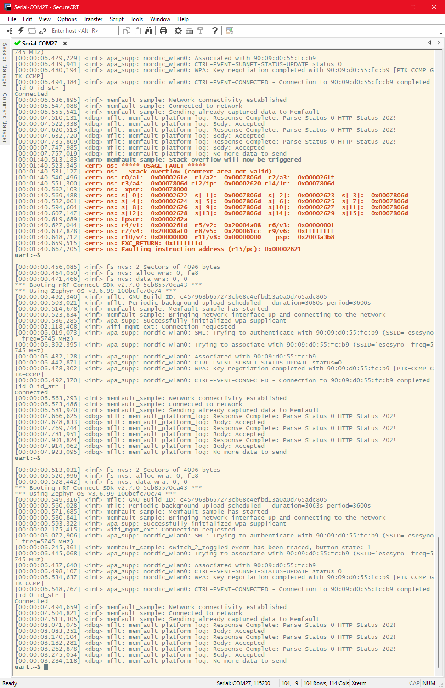
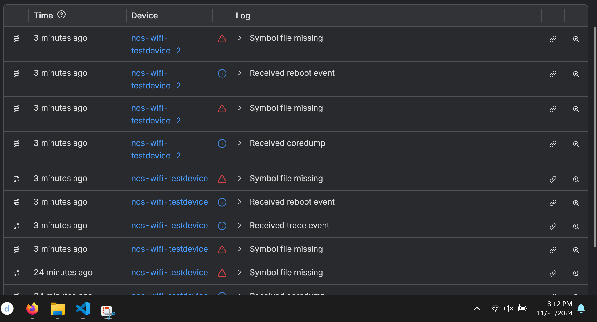
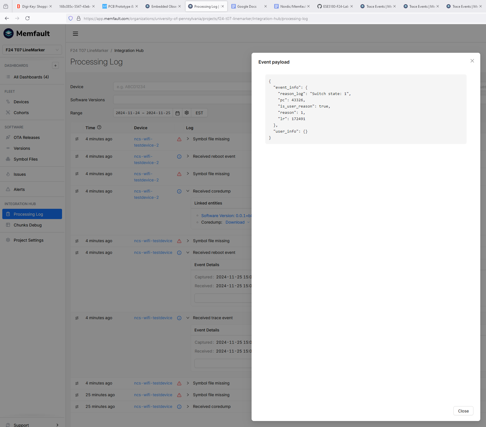

## 1. The Idea
The original idea for the IoT Venture was to create a smart dog feeder. Significant research was put into this and can be referenceed here. However, it was decided to pivot to a more ambitious project and due to some interesting use cases of RTK-GPS for aerial robots, a decision was made to research applications for ground robots instead. Leveraging similar technology, there is a uniqe advantage to accurately knowing the location of a ground robot for using a tool, end effector, or actuator in the real world.

This led to the idea of developing an RTK-GPS system for mobile robots by creating a rover and base station module using a combined RTK-GPS module, a LoRa module, and leveraging the nRF 5340 where the base station corrects the relative position of the rover using RTCM correction data. This would allow the mobile robot to have a painting tool and follow a specified path with GPS coordinates that form trajectories for the robot to navigate and paint sport field lines.

So, all areas were changed, including:
1. Target Market & Demographics

The target market for an RTK-GPS system for mobile robots can be people looking for very accurate positioning, but a unique opportunity was focused on within the sports industry. For sport fields, lines are painted precisely and take up to 60 man hours of time to prepare the field for a game. An automated solution presents a unique opportunity to lower the cost and time to prepare as the system can operate with minimal human intervention while maintaining centimer level accuracy. Specifically, professional sport fields would be the best first customer as it would increase the credibility of the solution while also providing the best case for testing the solution with professional athletes, maintenance crews, and other field personel.

2. Security, Hardware, & Software Requirements

The plan for security is to implement it on top of core functionalities of the product that the customers would expect to see. As the location based system is most relevant and breaking into the RTK-GPS system or interfering with robot operation is low risk if compromised, security was not seen as a prominent issue for the minimum viable product demo. It is extremely important to consider security in the context of another node on a network that is part of a sports stadium. This led to design paradigms around WPA3 and TLS encryption for WiFi
and encrytping RTCM data and pre-share encryption keys leveraging the Diffie-Hellman exchange. Therefore, as the system is tested and scaled, more security features will be added to ensure that the RTK-GPS module or the nRF 5340 are not weak points in an overall network security setup. It is possible to connect the system to the stadium's WiFi network but it is also a viable solution when the business transitions to a service for technicians to bring a router and setup their own temporary network for operations.

3. Product Function & Components

The product function completely changed except for the nRF 5340 chip at the core as part of the nRF 7002 DK.

The key idea can be seen in this system diagram:

4. Power & Cost Budgeting

Power budgeting remained similar as it was decided to power the device off of a portable charger for the minimum viable product demo. However, the RTK-GPS solution would benefit from 12 hours of battery life to allow it to operate autonomously overnight with margins for safety.*

## 2. Reflecting on the Venture Pitch
Going back to the original Venture Pitch, the main concerns with the smart dog feeder that were discussed were unique features for market penetration, reliability of the dispensing mechanism being a mechanical factor limiting progress, and an innovative user interface. Reflecting on this, the project was changed because a newer market that transfers technology would better benefit from IoT features integrated into a novel product.

A second Venture Pitch was done that highlighted the wireless communication with WiFi and LoRa, development with an RTK-GPS module (ZED-F9P), andthe use of off the shelf robot solutions. This combines into a feasible demo with a lean team for engineering and scalability considerations to integrate with existing stadium infrastructure. The primary focus for the product and demo is to target professional sports fields to acquire credibility, funding, and marketability from working with an initial high profile client.

## 3. Key Successes

1. NTRIP Server:

The NTRIP server from RTK2go.com was successfully leverage to gather GPS correction data based on a station in Pottstown, Pennsylvania. The connection is made following the specification of the NTRIP host, port, and mount point. A TCP connection is made to the NTRIP server, then a formatted HTTP GET request is sent to the specified mount point, and finally the nRF 5340 receives RTCM correction data.

2. Filtering RTCM Correction Data:

The RTCM correction data is filtered to ensure that only the necessary RTCM message types required by the ZED-F9P cinluding 1005, 1074, 1084, 1094, 1124, 1230 for high precision positioning. This also improves the bandwidth and prevents overloading of the ZED-F9P by reducing the amount of data sent from the nRF 5340.

3. UART Transmission:

Using Zephyr and the device tree, UART 1 is specified for communication allowing for this code to be better transferred between development boards. Specifying the device tree required a more complex configuartion through nRF Connect but would hopefully result in easier development moving forward.

4. Procedural Processes:

All steps of connecting to the NTRIP server up to the transmission of RTCM correction data detail the current step of the process and any possible errors including the network connection, binding the UART device, and resolving the host. This allows for all devices in a fleet on boot up to easily show errors for fixing any possible formatting issues most likely related to specifiying the correct information for the NTRIP server, the WiFi network, or possible UART availability. The first two are primarily of interest to customers or technicians who need to implement a specific setup. Callbacks are implemented as well for dealing with network connections to capture errors with WiFi. This allows for the device to trigger a response and would further help with reporting issues in a fleet of wireless devices.

5. Technology for Clients:

The technology developed for this project looks to use an engineered device in a way that is designed for use by those without an engineering background. This is because many of the workers maintaining sports fields likely are not exposed to these topics. The opportunity presented would allow for a business model leveraging technicians familar with the system to service and possibly operate multiple autonomous systems in a metropolitan area.

## 4. Key Areas for Improvement

1. Project Timeline:

The pivot from the initial idea required more attention from the group to focus on the change in technology. Many tasks were pushed off relating to Memfault and the LoRa module. Parts did not arrive on the expected timeline due to orders from Detkin falling behind so the time to work with the nRF 7002 DK and the ZED-F9P was less than expected.

2. Full Memfault Integration:

The full Memfault integration was not achieved because of misunderstandings with using the Memfault metrics feature. Core dumps were achieved and an event was triggered but not reported to the Memfault graphs. Setup was done within the methodology of the code for Memfault integration to implement code for tracking metrics.

3. Full RTCM data for RTK Lock:

The RTCM data for RTK lock is transmitted out of the nRF 7002 DK but it is not recognized by the ZED-F9P. This is likely due to a message formatting issue with how the RTCM data is packaged. Attempts were made to try and identify the message structure based off of a Sparkfun guide but were not fully formatted correctly for the demo.

## 5. Improving Workflow

The workflow can be drastically improved by better dividing tasks for the workflow. It would make more sense to get the Memfault features fully working before the RTK-GPS parts arrived and to also format more of the NTRIP server connection before parts arrived.

It would also make sense to devote more time to identifying specific message protocol structures further back in the ideation phase as it would provide a stronger outline for writing code further down the line in the development process. This could also allow for tests to be written to check message structure before the code parses the message to send to a device.

## 5. Improving Technology

The system could be improved picking a better power source for the RTK-GPS module and the nRF 5340. Currently it can operate off of a portable charger, but it would make sense to look into a NiMH battery or a LiPo battery to use in the design. An NiMH battery would likely make more sense as it is less voltatile and can handle improper charging better than a LiPo battery which would be a primary concern considering the use of the device outdoors.

The wireless communication protocol was correct but the option for a wired connection to the base station would make sense with a temporary or weak connection to WiFi that periodically sends updates to Memfault or downloads files for sport field lines on a more inconsistent schedule.

The target market can be further explored to identify the ideal first customer to further collaborate with in developing the technology. It is likely that the ultimate strength of the system could be in its adaptability to different designs as the precise tracking implemented would be useful across different types of sport fields, vendor markers for an outdoor market, and guidelines for a temporary parkling lot. For this reason, the software can be further leveraged to explore how to convert drawings into coordinates to track with the GPS.

## 6. Product Demo

### Minimum Viable Product Setup:

Picture here*!

### Core Functionality:

The system initializes and streams RTCM data, providing location and time of base station, satellite quality, and correction data containing carrier phase, pseudo-range, clock bias, and atmospheric corrections: https://drive.google.com/file/d/13XMZF255PdSiIMZWPl7YRpx98sbcSZYV/view?resourcekey

ZED-F9P GPS tracking can be seen in U-Center: https://drive.google.com/file/d/1RPHa82W0FPMpl-o1j9M5-3Sc8esZUcyS/view?resourcekey

### Memfault:
From Memfault it can be seen there are 2 devices:

From the serial monitor device 1 connects:

From the serial monitor device 2 connects:

Core dumps are received and can be downloaded to be analyzed:

From Memfault it can be seen there is a trace event:

In addition to these questions, include evidence of your product working.
Images of your MVP device
Remember, we have a light box in the Detkin Lab for taking nicer photos with good lighting.
You might not want a sterile environment for these photos - consider taking the photos where your device would be operating!
A video demonstrating:
Your Core Product Function
Memfault integration features
Anything else you think is relevant to the project
Imagine you’d like to show your family or a potential employer what you did this semester. What would you want to include?